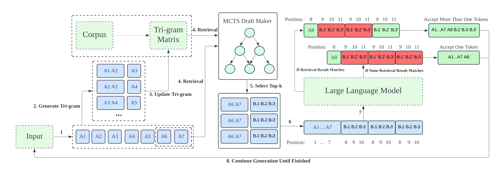
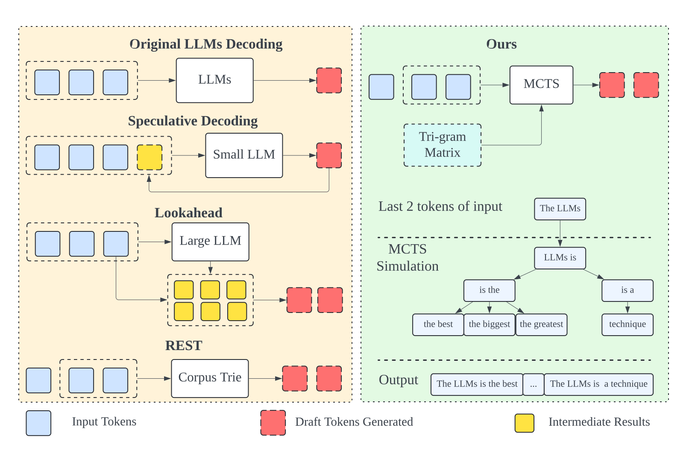
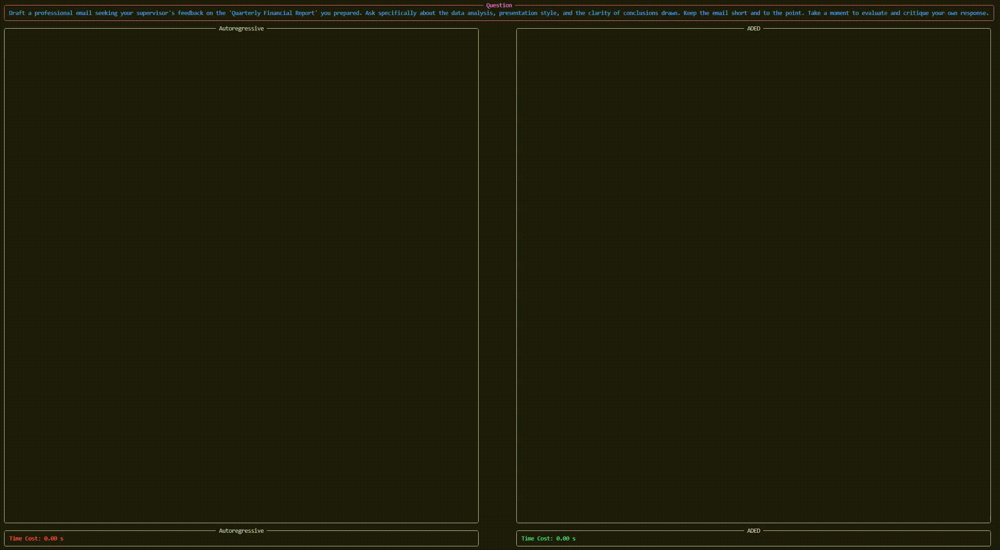
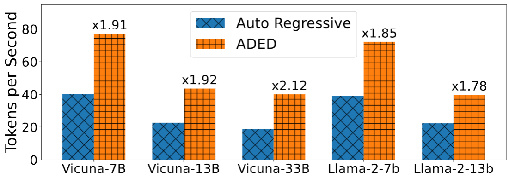
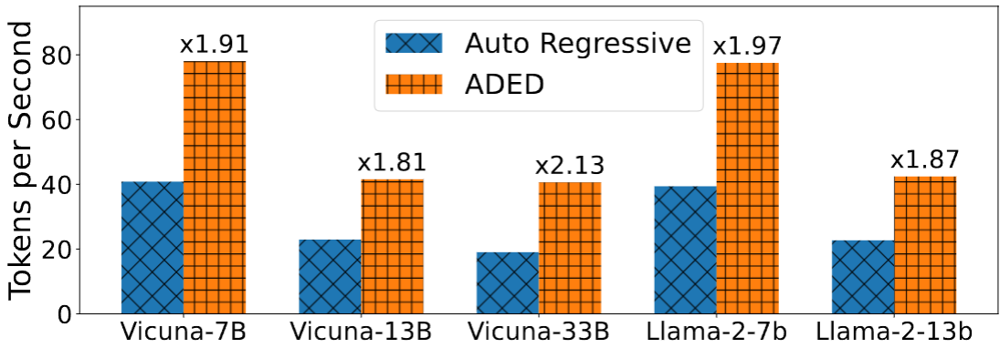
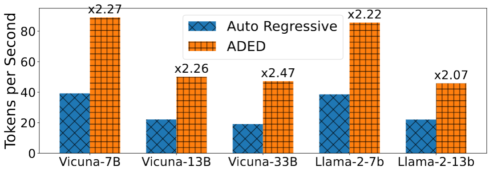
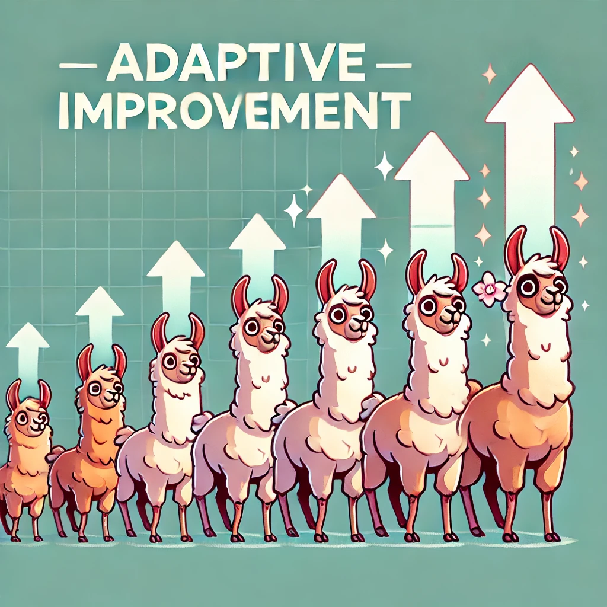

<p align="center">
    
</p>
<h1 align="center">
    ADED: Adaptive Draft-Verification for Efficient Large Language Model Decoding
</h1>

<p align="center">
| <a href="https://arxiv.org/abs/2407.12021"><b>Paper</b></a> | <a href="https://sites.google.com/view/aded-page/"><b>Blog</b></a> | <a href="https://github.com/liuxukun2000/ADED/issues"><b>Roadmap</b></a> | 
</p>

## Introduction

*ADED* is a kind of **Retrieval Based Speculative Decoding** method that accelerates large language model (LLM) decoding without fine-tuning, using an adaptive draft-verification process. It dynamically adjusts to token probabilities with a tri-gram matrix representation and employs *MCTS* to balance exploration and exploitation, producing accurate drafts quickly. *ADED* significantly speeds up decoding while maintaining high accuracy, making it ideal for practical applications.



## Motivation

Large language model (LLM) decoding involves generating a sequence of tokens based on a given context, where each token is predicted one at a time using the model's learned probabilities. The typical autoregressive decoding method requires a separate forward pass through the model for each token generated, which is computationally inefficient and poses challenges for deploying LLMs in latency-sensitive scenarios. 

The main limitations of current decoding methods stem from their inefficiencies and resource demands. Existing approaches either necessitate fine-tuning smaller models, which is resource-intensive, or rely on fixed retrieval schemes to construct drafts for the next tokens, which lack adaptability and fail to generalize across different models and contexts. 

To address these issues, we introduce a novel methodology called ADED, which accelerates LLM decoding without requiring fine-tuning. Our approach involves an adaptive draft-verification process that evolves over time to improve efficiency. We utilize a tri-gram matrix-based LLM representation to dynamically approximate the output distribution of the LLM, allowing the model to adjust to changing token probabilities during the decoding process. Additionally, we implement a draft construction mechanism that effectively balances exploration and exploitation, ensuring that the drafts generated are both diverse and close to the true output distribution of the LLM. The importance of this design lies in its ability to optimize the draft distribution adaptively, leading to faster and more accurate decoding. Through extensive experiments on various benchmark datasets and LLM architectures, we demonstrate that ADED significantly accelerates the decoding process while maintaining high accuracy, making it suitable for deployment in a wide range of practical applications.


<div style="display: flex; align-items: center;">
    
    
    
</div>

## Core Features 💡

|  |  |  |  |
|:-------------------------------------------------------------:|:-------------------------------------------------:|:----------------------------------:|:-------------------------------------------------:|
| **Plug-and-Play Acceleration**                                | **Minimal Memory Usage**                          | **No GPU Needed**                  | **Adaptive Improvement**                          |
| Achieves up to **2.5X** speed improvements in large language model decoding without the need for additional model training. | Efficiently accelerates decoding with a minimal memory footprint, requiring only **253MB** of corpus data for a **1.9X** speedup. | Operates **without the need for GPU resources**, making it highly suitable for deployment on devices with limited hardware capabilities. | Features an **adaptive mechanism** that improves prediction accuracy over time, ensuring better performance the more it is used. |

<!-- + **Plug-and-Play Acceleration**: Achieves up to **2.5X** speed improvements in large language model decoding without the need for additional model training. 

+ **Minimal Memory Usage**: Efficiently accelerates decoding with a minimal memory footprint, requiring only **253MB** of corpus data for a **1.9X** speedup. 

+ **No GPU Needed**: Operates **without the need for GPU resources**, making it highly suitable for deployment on devices with limited hardware capabilities. 


+ **Adaptive Improvement**: Features an **adaptive mechanism** that improves prediction accuracy over time, ensuring better performance the more it is used.  -->

## Installation
```bash
pip install -r requirements.txt
```

Then install `DraftRetriever`:

You can install via `pip`:
```sh
pip install draftretriever
```
Or you can follow the `README.md` in DraftRetriever.

## Build Corpus

Build a chat datastore using data from [UltraChat](https://huggingface.co/datasets/stingning/ultrachat) 
```bash
cd datastore
python3 get_datastore_chat.py --model-path lmsys/vicuna-7b-v1.5 --large-datastore True 
```
Build a Python code generation datastore from [The Stack](https://huggingface.co/datasets/bigcode/the-stack) 
```bash
cd datastore
python3 get_datastore_code.py --model-path codellama/CodeLlama-7b-instruct-hf --large-datastore True 
```
Build a chat datastore using data from [ShareGPT](https://huggingface.co/datasets/Aeala/ShareGPT_Vicuna_unfiltered)
```bash
cd datastore
python3 get_datastore_chat.py --model-path lmsys/vicuna-7b-v1.5 
```


The corpus generated using the above commands will be larger than the data presented in our paper. This is because, for the convenience of testing the impact of corpus pruning, the generated corpus here retains the complete 3-gram (unpruned). The corpus will be pruned during reading, keeping only the top-12 entries with the highest probabilities (changeable as needed).

## Inference

### Inference on MT-Bench
```bash
cd llm_judge
CUDA_VISIBLE_DEVICES=0 python gen_model_answer_aded.py --model-path lmsys/vicuna-7b-v1.5 --model-id vicuna-7b-v1.5 --datastore-path ../datastore/datastore_chat_large.idx
```

### Inference on HumanEval
```bash
cd human_eval
CUDA_VISIBLE_DEVICES=0 python aded_test.py --model-path lmsys/vicuna-7b-v1.5 --datastore-path ../datastore/datastore_stack_large.idx
```


## Acknowledgements
The codebase is mainly from [REST](https://github.com/FasterDecoding/REST), some code is from [Medusa](https://github.com/FasterDecoding/Medusa) and influenced by remarkable projects from the LLM community, including [FastChat](https://github.com/lm-sys/FastChat), [TinyChat](https://github.com/mit-han-lab/llm-awq/tree/main/), [vllm](https://github.com/vllm-project/vllm) and many others.

